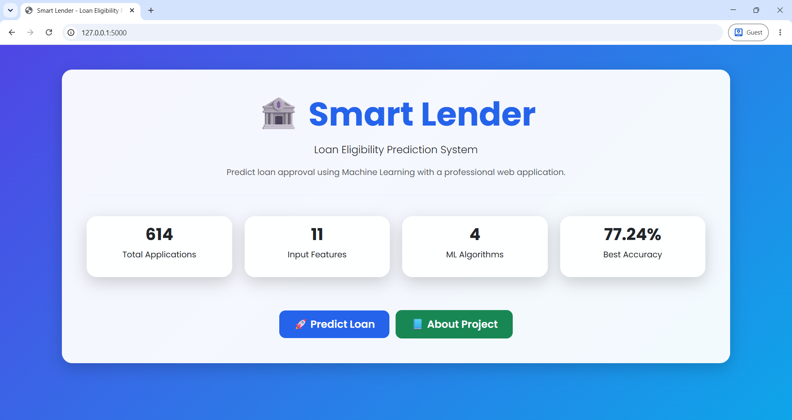
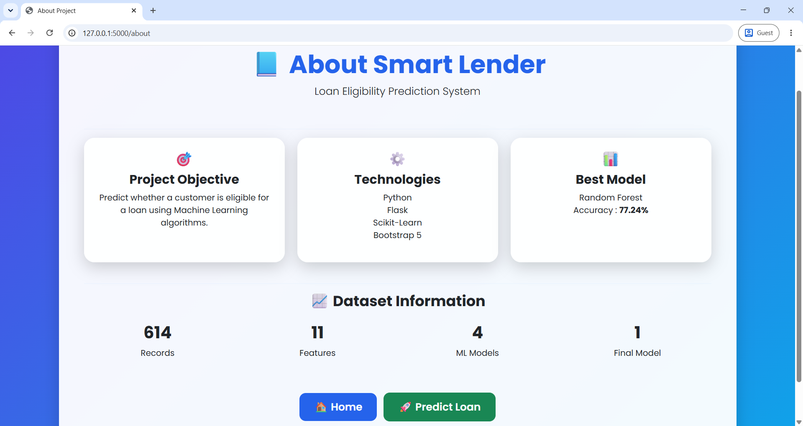

 # 🏦 Smart Lender – Loan Eligibility Prediction Using Machine Learning

# 📌 Project Overview

Smart Lender is a Machine Learning based Loan Eligibility Prediction System developed using Python, Flask, HTML, CSS and JavaScript.

The application predicts whether a customer is eligible for a loan based on financial and personal information using a trained Machine Learning model.

This project demonstrates the practical implementation of Machine Learning with Flask Web Development.

---

# 🎯 Objectives

- Predict Loan Eligibility
- Reduce Manual Loan Verification
- Improve Decision Making
- Real-Time Prediction
- Easy-to-use Web Interface

---

# ✨ Features

✅ Loan Eligibility Prediction

✅ Machine Learning Model

✅ Flask Backend

✅ Responsive User Interface

✅ Fast Prediction

✅ Input Validation

✅ User Friendly Design

---

# 🛠 Technologies Used

- Python
- Flask
- HTML5
- CSS3
- JavaScript
- Pandas
- NumPy
- Scikit-learn
- Visual Studio Code
- Git
- GitHub

---

# 📂 Project Structure

Smart-Lender/
│
├── Dataset/
│   └── loan_prediction.csv
│
├── Flask/
│   ├── static/
│   │   ├── css/
│   │   │   └── style.css
│   │   └── js/
│   │       └── script.js
│   │
│   ├── templates/
│   │   ├── index.html
│   │   ├── about.html
│   │   ├── predict.html
│   │   └── result.html
│   │
│   ├── app.py
│   ├── model.pkl
│   └── scaler.pkl
│
├── Screenshots/
├── Training/
├── requirements.txt
├── README.md
└── .gitignore
```

# 🔄 Workflow

Dataset

⬇

Data Preprocessing

⬇

Feature Engineering

⬇

Model Training

⬇

Model Evaluation

⬇

Model Saving

⬇

Flask Web Application

⬇

Loan Prediction

---

## 📸 Screenshots

### Home Page


### About Page


### Loan Eligibility Prediction


### Loan Approved


### Loan Rejected


# ⚙ Installation

Clone Repository
git clone https://github.com/shaikhaneef1/Smart-Lender-Loan-Eligibility-Prediction.git


Install Requirements
pip install -r requirements.txt


Run Project
python app.py


Open Browser
http://127.0.0.1:5000


---

# 🚀 Future Improvements

- Cloud Deployment

- Database Integration

- User Login

- Prediction History

- Explainable AI

- Mobile Friendly Version

---

# 👨‍💻 Author

## Shaik Haneef Jani

🎓 B.Tech CSE

🏫 Ramachandra College Of Engineering

🔗 GitHub

https://github.com/shaikhaneef1

🔗 LinkedIn

https://www.linkedin.com/in/haneef-shaik-7832ab36a

---

#  Acknowledgement

This project was developed as part of an AI & Machine Learning Internship to demonstrate Machine Learning deployment using Flask.

 